**Assessment**: T3A2-B - Real World App (Part B)
**Team Name**: White Magnum
**Team Members**:

- Cassie
- Luke
- Ragan

---

###Part A README appended after the below additions

---

####Github(s)
[Admin front end](https://github.com/jCold0ne/bronte-admin-front-end)
[User front end](https://github.com/CassieSloan/Bronte-Portfolio-Front-end)
[Backend](https://github.com/rmar8138/bronte-admin-express)

####Deployment
**Amazon S3**
[Main (user) front end](http://brontedavisphotography.s3-website-ap-southeast-2.amazonaws.com/gallery/portrait)
[Client (admin) front end](http://bronte-admin-front-end.s3-website-ap-southeast-2.amazonaws.com/)
**Heroku**
[Back end](https://floating-scrubland-52961.herokuapp.com/)
###Provides evidence of user testing:

[Production testing](https://docs.google.com/spreadsheets/d/1UcoFJhTJOHarnSa9ifJFClOp1EitlKSk59aZn6IIIVc/edit?usp=sharing)

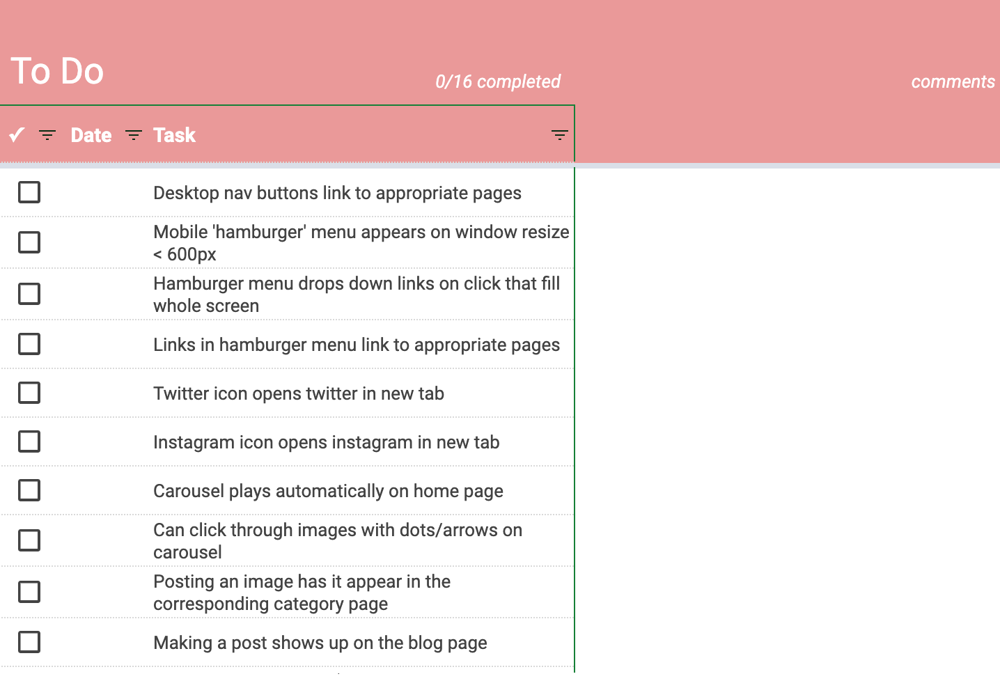
Above is the spreadsheet we asked Bronte to fill out to complete our user testing on the production side.

**Cypress**

- [Development testing for _portfolio front end_](https://github.com/CassieSloan/Bronte-Portfolio-Front-end/tree/master/cypress/integration)

- [Development testing for _admin front end_](https://github.com/jCold0ne/bronte-admin-front-end/tree/master/cypress/integration)

**Jest**

- [Development testing for _express backend_](https://github.com/rmar8138/bronte-admin-express/tree/master/tests)

---

###Continued agile task delegation/project organisation

We added more tasks and continued to track them through [Asana](https://app.asana.com/0/1155724488391785/list).

We also used sticky notes on the wall for daily breakdowns and assigning difficulty of tasks to keep our goals front of mind.
**_(green tags = easy)
(orange tags = tough)
(red tags = difficult)_**

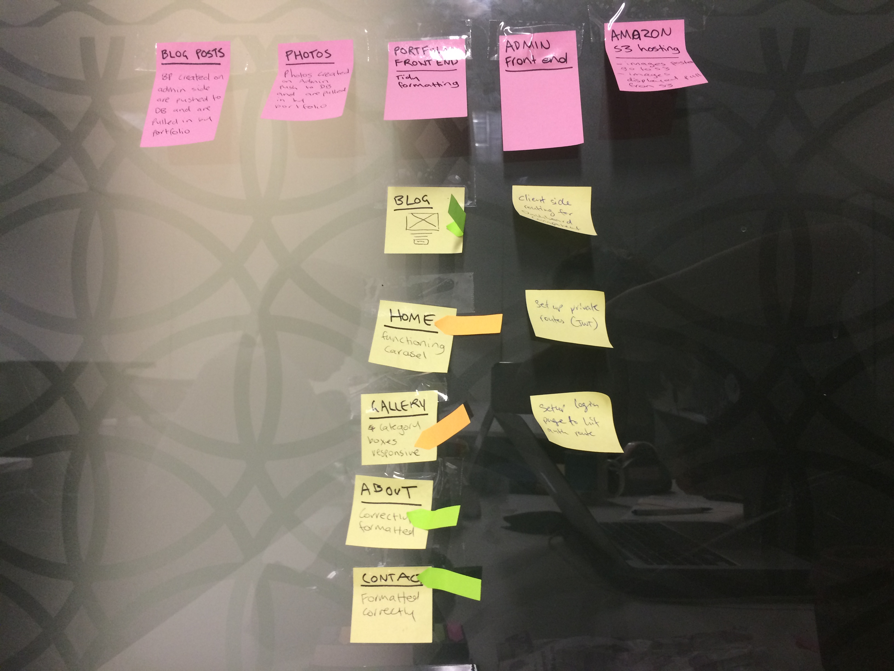
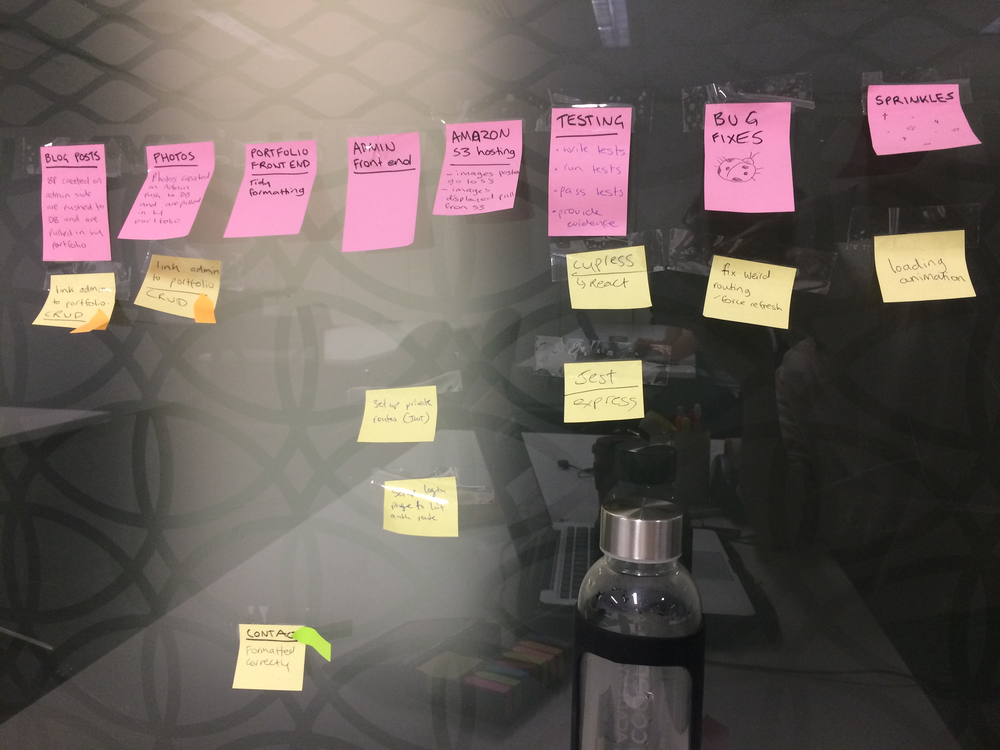
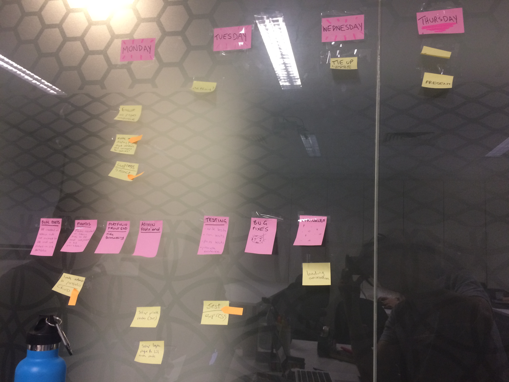
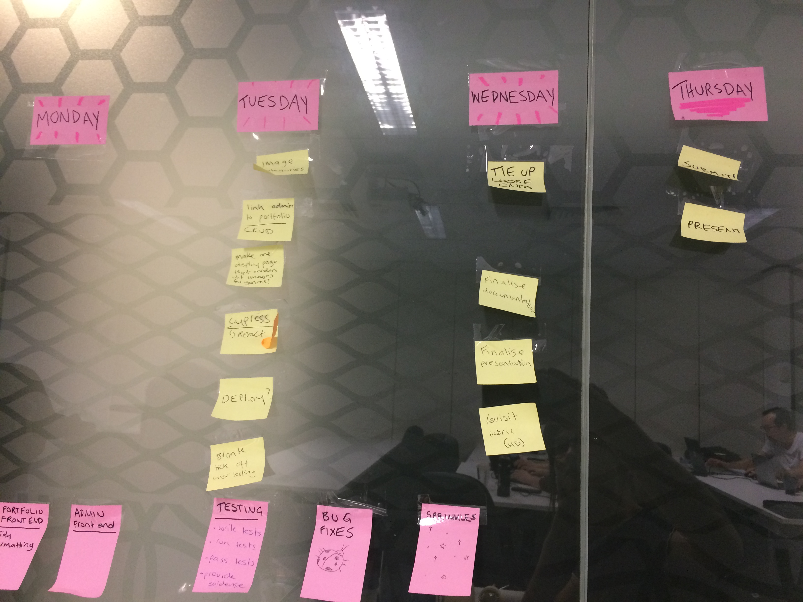

###Presentation slides

---

PART A README

---

**Assessment**: T3A2 PART A
**Team**: WHITE MAGNUM

- Cassie
- Luke
- Ragan

---

###Purpose

- Showcase Bronte’s abilities/services
- Attract potential clients
- Keep clients/viewers up to date with Bronte’s activities
- Show Bronte’s contact details for future business

The purpose of Bronte’s portfolio website is to showcase her photography, design services and blog to potential clients and general browsers. The website will be a platform where a potential client can view Bronte’s previous work, browse through her services and be able to contact Bronte for future business. Though the website is looking to generate business the main purpose is to showcase Bronte’s art and life in an online medium.

The website will present Bronte’s previous work in a way which matches the style of her photography employing a minimalist approach. The purpose of this is to create a frame for Bronte’s art which compliments the photography and entice potential clients/general users to explore the website further.

The blog component of the website aims to be a platform for self-expression and keeping potential clients/general browsers up-to-date with her current projects and life. The blog will maintain the minimalist theme of the website and be another way to generate interest in Bronte’s life and work.

---

###Functionality/Features

Bronte’s portfolio website will utilise a number of features to achieve the main purpose of showcasing her art, services and life while enabling users to get in contact for future business. The features of the website include the following;

**Home page carousel which shows only header images from blog posts/portfolio**

- When Bronte creates a post with an attached image, the image will be saved to the database and rendered as part of an image carousel.

**Contact form for users to email Bronte**

- The contact page will present users with a contact form where they can fill in their name, email, phone number and business enquiry - utilising Sendgrid to email Bronte the information.

**Navbar/hamburger dropdown for mobile**

- To navigate through the website, a clean navigation bar will be employed at the top of the page so users can browse through the entire website. A hamburger menu will be used for mobile.

**Admin dashboard where Bronte can maintain resources with full CRUD abilities.**

- A second react app and server providing Bronte with admin rights will be created. It’s here where she can create, read, update and delete posts on the portfolio website.

**Blog post for media upload**

- The website will have a blog page component where Bronte can create a post containing a Title, Description, Image and Image Caption + timestamp.

**Services page listing Bronte’s various services and pricing**

- The website will present Bronte’s various services with pricing breakdown.

**About me page with self-portraits, about me text and links to socials**

- The about me page will contain multiple images, text and hyperlinks to social media sites.

**Social icon buttons**

- Additional social media icon buttons will be available throughout the website.

**Animations (loading, transitions, hover, menu)**

- Various animations will be sprinkled throughout the website to add movement, colour and life to keep the user engaged and entertained.

**Styled components (Day/night mode themes)**

- A ‘sprinkle’ feature will be a styled component which gives users a day/night mode toggle button

---

###Target Audience

- Bronte (client)
- Prospective clients (of Bronte)
- General browsers

The target audience of the portfolio website is divided into three groups: **Bronte, prospective clients and general browsers.** While the way in which prospective clients and general browsers will consume the website will be similar, Bronte's use of the website will be completely different.

As the primary user of the website, **_Bronte_** will be the main target audience and given admin access to create, read, update and delete resources from the website. This access is given so Bronte has full control over the published content and provides choice of what she wishes to showcase. The website will be built in a way which allows Bronte to easily add/edit content to provide that choice and improve the maintainability of the website.

In addition to Bronte, the target audience of the website includes **_prospective clients_**. To cater to this audience the website will employ vivid imagery, animations and clear navigation tools to entice prospective clients to explore the website further. Ideally, a prospective client will navigate through the entire website to view Bronte’s work, services, blog and, most importantly, contact details. A contact form will be provided so that a prospective client can fill in their name, contact details and business enquiry so that Bronte can get in touch and discuss the enquiry further.

The website aims to attract an audience of **_general browsers_** to view Bronte’s art and blog. By employing vivid imagery, animations and clear navigation tools general browsers can easily navigate through the website to view Bronte’s overall style and be interested in her blog. Both prospective clients and general browsers will have read only access rights to protect the integrity of the website’s content.

---

###Tech stack

- **MongoDB**
  - MongoDB is a non-relational database, which will be used to store blog entries made by Bronte.
- **Express**
  - Express is a web server framework that runs with Node.js. Express will be used to handle the CRUD routes for both the photos and blog resources. It will also handle authentication and locking down certain admin routes via Passport and JWT.
- **React**
  - React is a front-end JavaScript framework that is responsible for rendering user-facing views and components. All routing will be handled on the client side via React Router.
- **Node**
  - Node is a runtime environment for JavaScript to run on the server side. Node will run the express web server, as well as handle JWT authentication for locking down the admin dashboard and routes.
- **AWS (S3)**
  - S3 is an AWS product that allows for cloud storage of images. This will be used to store the bulk of Bronte’s images, which will then be pulled into the application.
- **Heroku**
  - Heroku is a cloud-based application deployment service which the website will be deployed on.
- **Sendgrid**
  - Sendgrid is a third party transactional mail client that will handle any email being sent to Bronte via the email form on the contact page
- **Asana**
  - Asana is a task manager platform that is being used to track the progress of the application, and how the different tasks are delegated.
- **Slack**
  - Slack is a messaging system being used by the team for general communication and sharing of ideas.
- **Canva**
  - Canva is an online graphic design tool that is used to create the images and graphics that are seen on the application’s documentation.
- **Google docs**
  - for collaboration and idea sharing
- **VS code**
  - Integrated development environment to write our code in
- **Github/Gitkraken**
  - Github is an online source control platform that allows developers to collaborate. Gitkraken is a GUI interface that allows easier collaboration on projects.

---

###Application Architecture Diagram

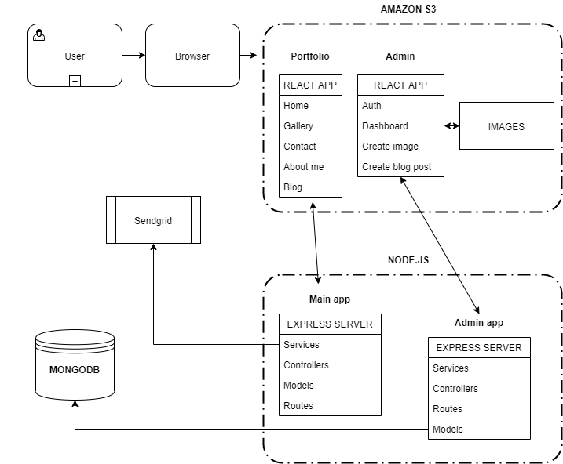

---

###Dataflow diagram
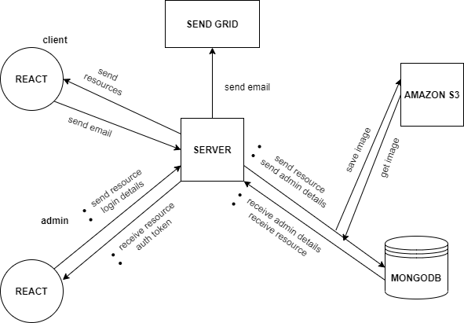

---

###Screenshots of your Trello board throughout the duration of the project

We chose [Asana](https://app.asana.com/0/1155724488391785/list) as our project/task manager.

Sections were broken down into **PART A** and **PART B.**

####**Part A**

Contains front and centre tasks for setting up the project, documentation and confirming the client, divided into sub tasks for trackable progress and descriptions for clarity on what needs to be done.

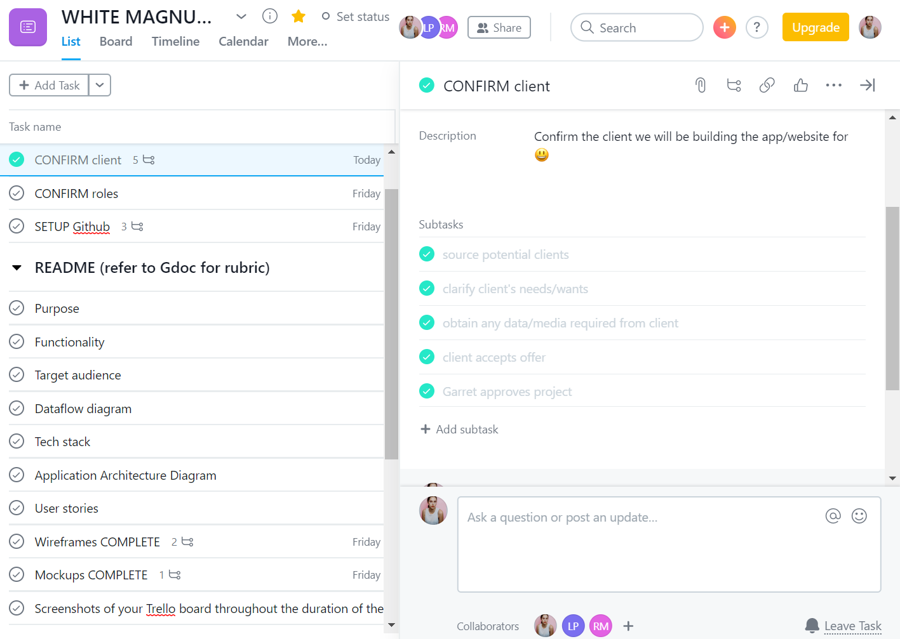

Part A also contains the requirements for our README (wow, this is meta). As each section is completed, they are ticked off.

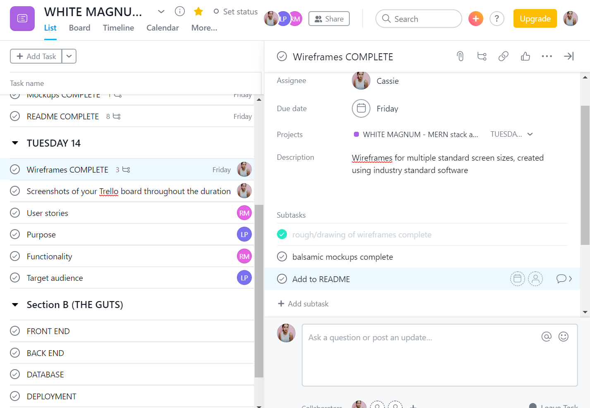

It's also been divided into days as we go, to keep track of what we want to accomplish during what timeframe.

####**Part B**

Contains tasks related to the programming of the project.

Part B contains a checklist of tasks related to the rubric requirements for the project, to ensure we don't stray from the brief.

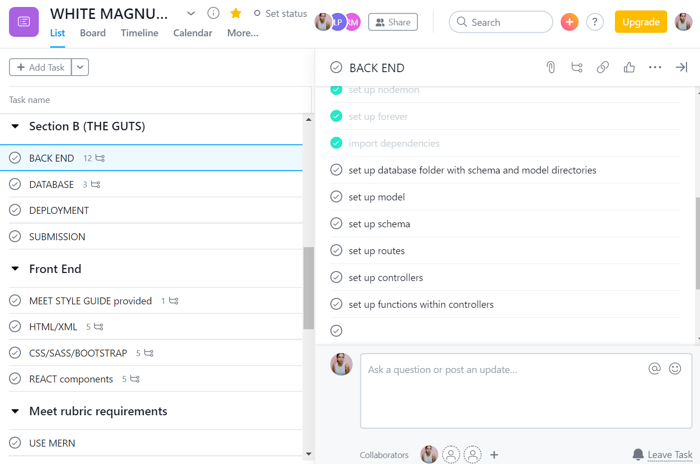

This section details client-provided parameters for what should be on each page and the style guidelines, as well as subtasks for building the front end, back end, and other essential steps during the project.

---

###User Stories

- As Bronte, I would like a portfolio website so I can _showcase my abilities and attract potential clients_.

- As Bronte, I would like to be able to CRUD my posts/content so that I can _keep my portfolio up to date._

- As Bronte, I would like to be able to _log-in as admin_ so I can manage my portfolio website

- As Bronte, I would like to be able to _update my credentials_ so I have control over my website

- As Bronte, I would like to be able to _access all client emails sent through the website_ so that I can contact them back

- As Bronte, I would like to share information about myself so viewers and _potential clients can know more about me_

- As a potential client, I want to be able to _contact Bronte_ so that I can make some business

- As a potential client, I want to be able to _see all of Bronte’s services_ so that I can _purchase/book the service_ that I need

- As a potential client, I want to be able to _see Bronte’s work_ so I can determine if I want her services or not

- As a general browser, I want to be able to read Bronte’s blog posts so I can _keep up to date with what she’s doing_

- As a user of the website, I want to be able to navigate through the website so that I can view all of the content available.

---

####Wireframes for multiple standard screen sizes, created using industry standard software
HOME

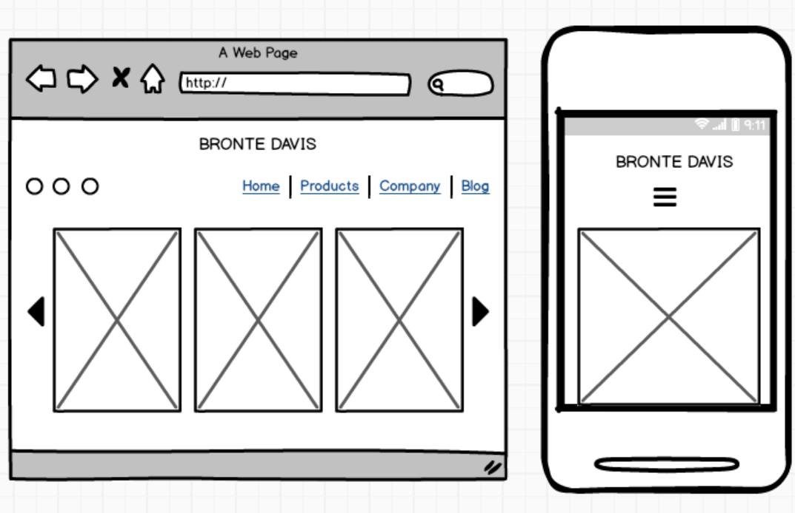

GALLERY

BLOG

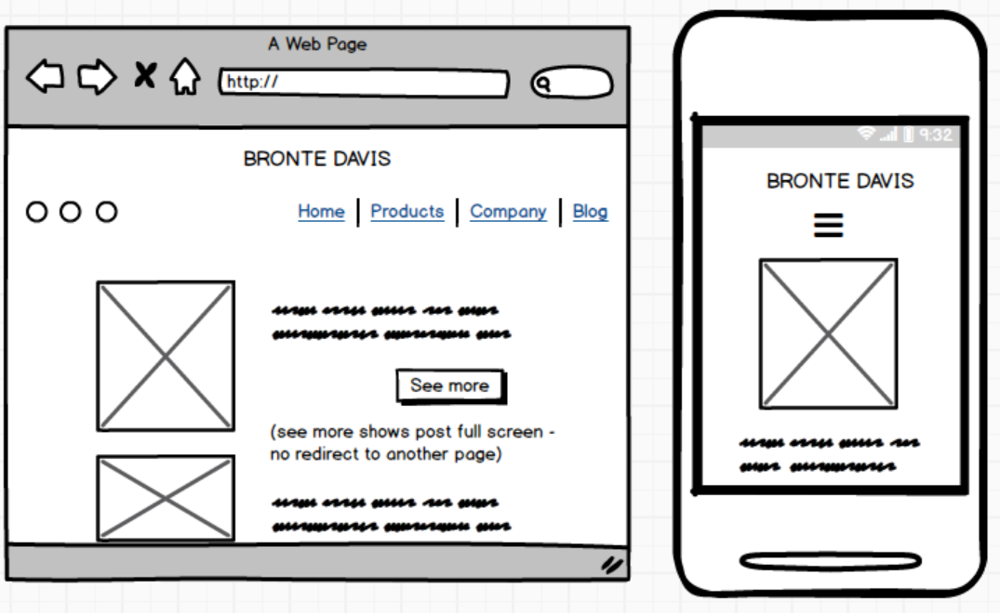

CONTACT

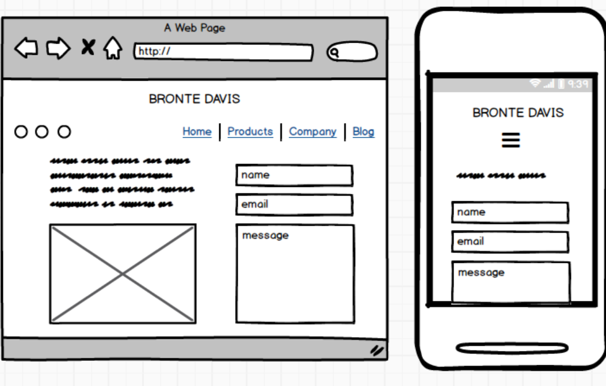

ABOUT ME

**INTERACTIONS**

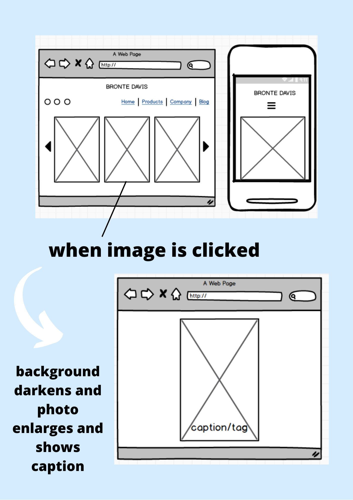
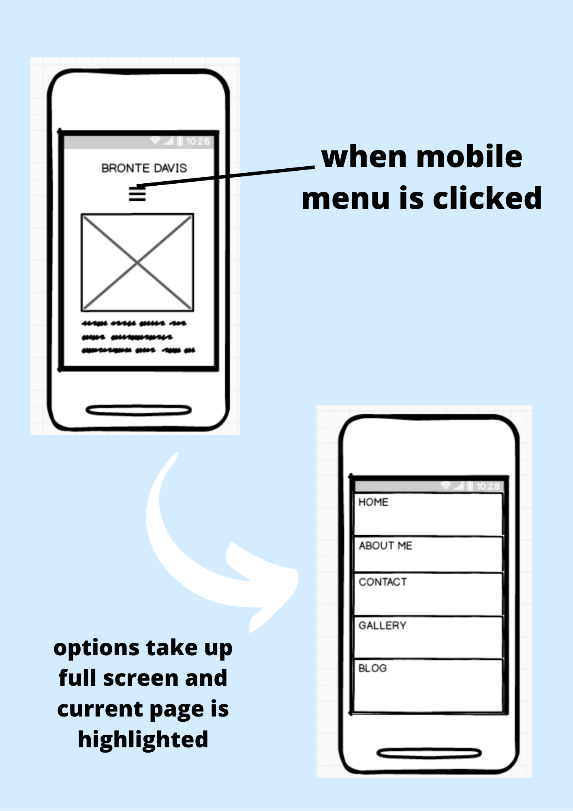
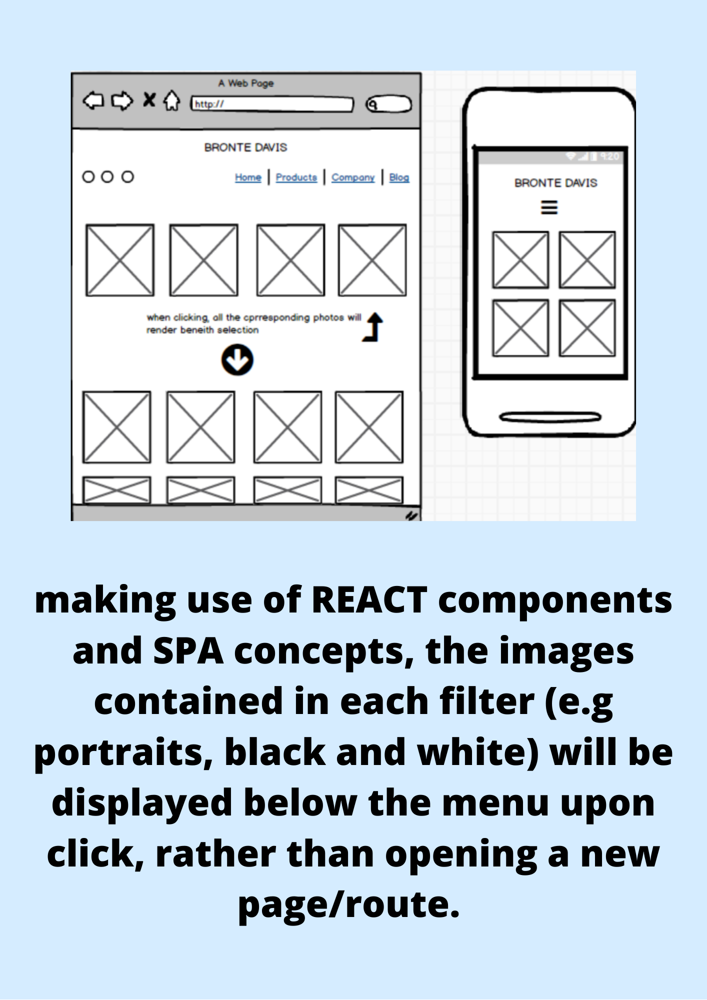

---
